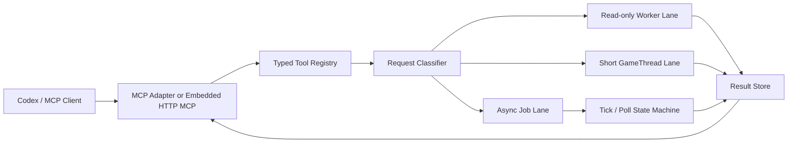

# UnrealBridge 可靠性与能力优化执行计划

> 文档状态：全部批次已完成并实装
> 创建日期：2026-07-13
> 完成日期：2026-07-13
> 目标引擎：Unreal Engine 5.6.1
> 工作仓库：`C:\dev\UnrealBridge`
> 集成项目：`C:\dev\ShooterRoyal`
> 上游镜像：`C:\dev\unrealbridge-master\UnrealBridge`

---

## 1. 文档目的

本文档用于指导 UnrealBridge 后续优化，解决当前最影响 Codex 工作流的三类问题：

1. 旧 `UnrealMCP` 与 UnrealBridge 并存，调用入口混淆，产生大量假超时。
2. UnrealBridge 将 Python 同步串行执行在 GameThread，缺少可靠的长任务、取消和结果恢复语义。
3. Bridge API 数量已经较多，但类型 Schema、能力发现、批处理和部分高价值编辑能力仍不完整。

本文档同时记录旧 UnrealMCP 的能力审计结果，明确哪些能力需要迁移、哪些已经被替代、哪些不应进入 UnrealBridge 核心。

后续实施必须按本文档的批次顺序推进。每一批单独完成代码审查、构建和验收，禁止把可靠性底座与大量新功能混在一次修改中。

---

## 2. 实施前基线与完成态

### 2.1 UnrealBridge 实施前基线

- 当前本地上游基线提交：`d63b3343d02774921446d04f12f7d687a969e7ae`
- 提交日期：2026-05-23
- 实施前 manifest：32 个 library、1116 个 wrapper function
- 实施前参数记录：2586 个参数，但 manifest 中 `type` 字段均为空
- 实施前传输：本机 TCP、4 字节长度前缀、JSON 请求/响应
- 实施前执行：所有 Python exec 进入单一 MPSC 队列，由 GameThread ticker 每帧最多取一个执行
- 实施前 Codex adapter：外部 Python FastMCP stdio 进程，约 15 个 grouped tools

当前 `C:\dev\UnrealBridge` 已有未提交的本地增强。后续实施必须保留现有改动，不得用上游目录覆盖工作目录。

### 2.2 旧 UnrealMCP 基线

- Codex 服务端：`C:\dev\unreal-engine-mcp\Python\unreal_mcp_server_advanced.py`
- ShooterRoyal 插件：`C:\dev\ShooterRoyal\Plugins\UnrealMCP`
- UE TCP 端口：`55557`
- MCP tool 数量：77
- 超时：`execute_python` 默认等待 300 秒，失败后最多自动重试 4 次
- UE 插件接收逻辑：非阻塞 socket accept 后立即 `Recv`

### 2.3 2026-07-13 停用状态

- [x] Codex 全局配置已移除 `[mcp_servers.unreal_engine]`
- [x] Codex 全局配置已增加 `[mcp_servers.unreal_bridge]`
- [x] `Plugins/UnrealMCP/UnrealMCP.uplugin` 已设为 `EnabledByDefault=false`
- [x] grouped adapter 的目标发现/连接失败已改为普通工具错误，不再退出 MCP server
- [x] 重启 Codex 后确认只暴露 `unreal_bridge` 工具
- [x] 重启 Unreal Editor 后确认 `UnrealMCP` 未加载且 `55557` 未监听
- [x] 确认 UnrealBridge `11437` 仍可连接

旧插件和旧仓库暂不删除，作为迁移审计资料保留。完成全部迁移和至少两个稳定版本验证前，不做物理清理。

### 2.4 2026-07-13 完成态

- 插件版本：`2.0.0`，协议版本：`2`
- 实际反射 manifest：34 个 library、1179 个 UFUNCTION、5 个 enum
- 严格握手：`plugin_version`、`registry_hash`、`manifest_hash`、`wrapper_version` 全部一致后才允许执行
- 传输：保留 TCP/discovery，并新增 `127.0.0.1:11438` bearer-token HTTP MCP/REST endpoint
- 执行：普通短 Job、可恢复 durable Job、多帧 polling Job、queue deadline、取消、幂等和结构化错误
- 资产安全：ChangeSet 事务、预览、显式提交/回滚、Job package ownership、已有 dirty package 保护
- 生成物：manifest 与 kwargs-only wrapper 已按 UE 5.6.1 实际反射重新生成并同步到 ShooterRoyal

---

## 3. 超时问题的证据与根因

### 3.1 两条调用链混用

此前工具名 `mcp__unreal_engine__execute_python` 实际调用链为：

```text
Codex
  -> C:\dev\unreal-engine-mcp\Python\unreal_mcp_server_advanced.py
  -> ShooterRoyal/Plugins/UnrealMCP
  -> TCP 55557
```

真正的 UnrealBridge 调用链为：

```text
Codex / bridge.py / unreal_bridge_mcp_server.py
  -> ShooterRoyal/Plugins/UnrealBridge
  -> TCP 11437
```

因此旧会话中大量被称为“UnrealBridge 超时”的调用并未经过 UnrealBridge。

### 3.2 旧 UnrealMCP 的 zero-read 竞态

近期会话中至少出现 10 次 `accept` 后立即读取到 zero bytes，其中 6 次最终表现为 Codex 等待 300 秒超时。根因是：

1. 服务端接受非阻塞 socket。
2. 服务端没有先等待可读事件，立即调用 `Recv`。
3. 客户端数据尚未到达时，`Recv` 返回 0。
4. 服务端将其错误解释为断开连接并丢弃请求。
5. Python MCP 客户端等待 300 秒后重新发送。

日志中多次出现脚本在重试后只执行 `0.17` 到 `3` 秒，但外层 Codex 已经先报告 300 秒超时。

### 3.3 自动重试修改操作不安全

旧 MCP 没有 `idempotency_key`。若 UE 已完成修改但响应丢失，自动重试可能导致：

- 重复创建资产或 Actor
- 重复添加 Blueprint 节点
- 重复写入 DataTable 行
- 重复执行保存、导入或关卡修改

因此新的 UnrealBridge 协议必须遵守：**只读调用可以受控重试，修改调用禁止盲目自动重试。**

### 3.4 UnrealBridge 自身的同步 GameThread 限制

UnrealBridge 当前会把完整 Python 脚本同步交给 `ExecPythonCommandEx`。这会产生以下问题：

- 截图、编译、PCG、PoseSearch 等依赖后续 Editor Tick 的操作可能卡住。
- 客户端超时后，已排队的请求仍可能随后执行。
- `ping` 绕过 exec 队列，只能证明服务器线程存活，不能证明执行队列健康。
- 长任务占用 GameThread 时，后续任务全部排队。
- 客户端断开后无法查询原任务到底是否完成。

新的协议必须把“连接超时”和“任务结果”解耦。

---

## 4. UnrealMCP 能力审计

### 4.1 审计结论

旧 UnrealMCP 暴露 77 个 MCP tools。整体结论如下：

| 分类 | 结论 |
|---|---|
| Actor、Level、Blueprint 读取与图编辑 | UnrealBridge 已有等价或更强能力 |
| Material、Sequencer、Niagara | UnrealBridge 已覆盖且接口更完整 |
| Widget Tree、动画、预览、校验 | UnrealBridge 已覆盖 |
| BehaviorTree、Blackboard、AssetFactory | UnrealBridge 已覆盖 |
| 通用 Blueprint 创建 | UnrealBridge 缺少，值得迁移 |
| Blueprint 组件材质类型化接口 | 通用属性接口可勉强替代，但值得补正式 API |
| 组合式场景查询 | 单项原语存在，缺少一次调用的组合过滤与分页 |
| 空位搜索 | UnrealBridge 缺少直接接口，值得重新实现 |
| Python API 搜索 | 不应原样迁移，应改为 Bridge API/Schema 自省 |
| `widget_mvvm_edit` | 旧实现只是“不支持”占位，不存在可迁移能力 |
| 房屋、城堡、迷宫等宏 | 演示型 recipe，不应进入 Bridge 核心 |

### 4.2 已被 UnrealBridge 替代的能力

以下旧工具不需要迁移代码，仅需在兼容文档中给出新 API 映射：

#### Actor 与关卡

```text
get_actors_in_level
find_actors_by_name
delete_actor
set_actor_transform
scene_summary
find_nearby_actors
level_inspect
actor_inspect
```

对应 UnrealBridge 的 `Level.list_actors`、`Level.get_level_summary`、`Level.find_actors_in_radius`、`Level.get_actor_info`、`Level.destroy_actor`、`Level.set_actor_transform` 等接口。

#### Blueprint 读取与编辑

```text
add_component_to_blueprint
set_static_mesh_properties
set_physics_properties
compile_blueprint
read_blueprint_content
analyze_blueprint_graph
get_blueprint_variable_details
get_blueprint_function_details
add_node
connect_nodes
create_variable
set_blueprint_variable_properties
add_event_node
delete_node
set_node_property
create_function
add_function_input
add_function_output
delete_function
rename_function
```

UnrealBridge 已具备更完整的节点工厂、图快照、图 diff、lint、自动布局、断点和批量 graph ops。

#### Material、Sequencer、Niagara

```text
get_available_materials
apply_material_to_actor
get_actor_material_info
material_inspect
material_edit
sequencer_edit
niagara_edit
```

UnrealBridge 已有 Material Graph 创建、连接、编译、预览、统计、MI 参数，Sequencer binding/track/key，以及 Niagara 查询、spawn 和参数设置。

#### Widget / UMG

```text
widget_inspect
create_widget_blueprint
widget_tree_inspect
widget_add
widget_remove
widget_rename
widget_reparent
widget_set_property
widget_set_slot
widget_set_commonui_style
widget_bind_event
widget_animation_edit
widget_preview
compile_save_widget_blueprint
validate_widget_blueprint
```

UnrealBridge 已有对应 UMG API。旧实现的动画写入也只支持 direct float property，UnrealBridge 已提供 `add_widget_animation_float_key`。

#### AI 与通用资产工厂

```text
behavior_tree
asset_factory
search_assets
project_context
editor_actions
performance_audit
```

BehaviorTree、Blackboard、Enum、Struct、DataTable、InputAction、InputMappingContext 均已有 UnrealBridge API。`project_context` 与 `performance_audit` 可由现有结构化快照覆盖。

### 4.3 值得融合的能力

#### M1. 通用 Blueprint 创建

新增建议：

```text
Blueprint.create_blueprint(asset_path, parent_class_path, blueprint_type, compile, save)
```

要求：

- 支持完整 `/Game` 或插件内容路径，不硬编码 `/Game/Blueprints`。
- 严格解析 parent class，找不到时返回错误，不静默退回 `AActor`。
- 已存在资产时默认失败，可显式选择 `return_existing`。
- 创建、编译、保存拆分为明确选项。
- 返回结构化结果：路径、父类、创建/已存在、编译状态、保存状态。
- 整个操作进入单一 `FScopedTransaction`。

旧 UnrealMCP 实现存在路径硬编码和父类解析失败后静默降级问题，只迁移需求，不复制代码。

#### M2. Blueprint 组件资产与材质类型化接口

新增建议：

```text
Blueprint.set_component_static_mesh(...)
Blueprint.get_component_materials(...)
Blueprint.set_component_material(...)
Blueprint.set_component_physics(...)
```

理由：

- `set_component_property` 可以作为底层兜底，但复杂数组、对象引用和 physics 字段不适合让调用方拼 ExportText。
- 类型化 API 可以做类检查、slot 范围检查、资产类型验证和更清晰的错误输出。
- 不迁移旧 `set_mesh_material_color` 的临时 Dynamic Material 写法；颜色应通过 Material Instance 参数资产化处理。

#### M3. 组合式场景查询

新增建议：

```text
Level.query_actors(
    class_filter,
    name_filter,
    tags,
    bounds,
    folder,
    level_path,
    selected_only,
    property_predicates,
    cursor,
    page_size
)
```

要求：

- 一次遍历完成组合过滤，避免模型发出多次查询后在客户端求交集。
- 支持分页、稳定排序和 continuation cursor。
- 返回 `truncated`、`next_cursor`、扫描数量和耗时。
- 默认只返回 brief，按需扩展 details，避免超大响应。

#### M4. 空位与放置候选搜索

新增建议：

```text
Level.find_placement_candidates(origin, extent, spacing, shape, clearance, surface, max_results)
```

要求：

- 使用 collision overlap/trace，而不是对全部 Actor 做简单距离判断。
- 支持 capsule、box、sphere clearance。
- 支持投射到地面、最大坡度、NavMesh 可达性和指定碰撞通道。
- 返回失败原因统计，例如 `blocked`、`no_ground`、`slope_exceeded`。
- 大范围扫描作为异步 Job 执行并报告进度。

#### M5. Bridge API 与 Schema 自省

旧 `unreal_api` 会搜索 `unreal` Python module。新设计不应继续依赖 Python introspection，而应新增：

```text
Bridge.list_libraries()
Bridge.search_functions(query, library, risk, execution_mode)
Bridge.describe_function(library, function)
Bridge.get_capabilities()
```

数据来源必须是 UFUNCTION/FProperty metadata 和生成的 manifest，返回真实输入类型、默认值、输出类型、风险等级、线程要求和版本信息。

#### M6. 紧凑项目上下文

新增一个只读聚合接口，减少模型启动工作流时的多次往返：

```text
Editor.get_project_context(include_asset_summary=false)
```

包含 Engine 版本、项目名、当前关卡、PIE 状态、dirty package 数量、当前选择、Bridge 构建版本和 manifest hash。它不是新底层能力，但对调用效率有明确价值。

### 4.4 不进入核心的旧能力

以下 13 个工具属于演示型场景生成宏：

```text
create_pyramid
create_wall
create_tower
create_staircase
construct_house
construct_mansion
create_arch
spawn_physics_blueprint_actor
create_maze
create_town
create_castle_fortress
create_suspension_bridge
create_aqueduct
```

处理原则：

- 不迁移到 UnrealBridge C++ 核心。
- 后续如有需求，放入 `examples/recipes` 或 workflow/macro 层。
- recipe 只能调用稳定的 Bridge 原语，不能直接访问内部 UObject。
- recipe 必须支持 dry-run、随机种子、命名空间和批量撤销。

`widget_mvvm_edit` 当前只返回 unsupported，不列为已具备能力。真正的 MVVM 编辑需以后单独研究 `UMVVMWidgetBlueprintExtension`，不能把占位接口计入迁移成果。

---

## 5. 优化设计原则

后续实现必须满足以下不变量：

1. **超时不等于失败。** 返回超时时必须能查询任务最终状态。
2. **过期请求不得随后执行。** 排队请求超过 deadline 后必须在进入 GameThread 前终止。
3. **修改操作禁止盲目重试。** 必须提供 `idempotency_key` 或由用户明确重新提交。
4. **GameThread 只做必须在 GameThread 上完成的短步骤。** 长等待拆成 tick/poll 状态机。
5. **一个 AI 修改请求对应一个 Undo。** 跨多个 UObject 的修改必须进入同一事务。
6. **默认不保存。** 创建/修改、编译和保存是三个可区分阶段。
7. **结果必须可恢复。** 客户端断线后可以凭 `job_id` 读取结果。
8. **输出必须有上限。** 大结果使用分页或写入 artifact 文件，不能无限堆在单个 JSON 响应中。
9. **能力必须可发现。** 插件、wrapper、manifest 和 MCP adapter 必须通过版本握手检测漂移。
10. **裸 Python 是逃生口，不是主要 API。** 必须标记为高风险、不可自动重试，并保留 outcome unknown 状态。

---

## 6. 目标架构



### 6.1 执行通道

| 通道 | 适用操作 | 示例 |
|---|---|---|
| Read-only Worker | 线程安全的 AssetRegistry、文件和 manifest 查询 | 搜索资产、磁盘大小、能力查询 |
| Short GameThread | 可在一帧内完成的 UObject 读写 | Actor transform、简单属性修改 |
| Async Job | 需要多帧、编译或大量数据的任务 | Landscape、PCG、shader、截图、批量保存 |
| Unsafe Python | 无正式 API 的临时逃生操作 | 狭窄的 `unreal.*` 调用 |

不能仅按“只读/写入”判断执行通道。某些只读操作，例如扫描全项目引用，也必须进入异步 Job。

### 6.2 Job 状态机

```text
queued
  -> running
  -> succeeded
  -> failed
  -> cancel_requested -> cancelled
  -> expired
  -> aborted
```

状态语义：

- `expired`：在执行前已超过 deadline，保证没有发生修改。
- `cancelled`：在可取消点停止，响应必须说明是否已有部分副作用。
- `aborted`：编辑器关闭、插件重载或进程崩溃导致无法继续。
- 客户端等待超时不改变 Job 状态。
- 断线后 Job 继续执行，除非请求显式指定 `cancel_on_disconnect=true`。

### 6.3 最小 Job API

```text
submit_job(operation, arguments, deadline, idempotency_key, save_policy)
get_job(job_id)
wait_job(job_id, wait_timeout)
cancel_job(job_id)
list_jobs(states, limit, cursor)
get_job_artifact(job_id, artifact_name, offset, length)
```

### 6.4 健康检查

新的 `health` 不能只返回 ready。至少包含：

```json
{
  "server_ready": true,
  "game_thread_responsive": true,
  "queue_depth": 0,
  "running_job_id": null,
  "oldest_queued_ms": 0,
  "completed_jobs": 0,
  "failed_jobs": 0,
  "expired_jobs": 0,
  "plugin_build": "...",
  "protocol_version": "...",
  "manifest_hash": "...",
  "engine_version": "5.6.1"
}
```

### 6.5 结构化错误

统一错误结构：

```json
{
  "code": "ASSET_NOT_FOUND",
  "message": "...",
  "phase": "validate",
  "retryable": false,
  "side_effect_state": "none",
  "trace_id": "...",
  "details": {}
}
```

`side_effect_state` 取值建议：`none`、`partial`、`complete`、`unknown`。

---

## 7. 类型化 Manifest 与工具注册

### 7.1 当前问题

当前 wrapper function 数量较多，但 manifest 参数 `type` 为空，导致：

- MCP 无法生成准确的 JSON Schema。
- 参数错误只能在 UE 端运行后发现。
- struct、array、enum、object path 的调用约定不清晰。
- grouped `bridge_call` 只能把 `kwargs` 当作任意 object。
- 插件和本地 wrapper 版本不匹配时没有强制报错。

### 7.2 目标元数据

每个可公开工具需要记录：

```text
library
function
description
input_schema
output_schema
risk: ReadOnly | Mutating | Destructive | Unsafe
execution: Worker | GameThreadShort | AsyncJob
save_behavior: Never | Optional | Required
supports_dry_run
supports_idempotency
introduced_version
required_plugins
```

### 7.3 UFUNCTION 自动注册

参考 Nwiro Integration Kit 的单 UFUNCTION 标记思路，建议使用 metadata：

```cpp
UFUNCTION(BlueprintCallable, meta=(
    UnrealBridgeTool,
    ToolRisk="ReadOnly",
    ToolExecution="GameThreadShort",
    ToolSaveBehavior="Never"
))
```

生成器通过 `UFunction` 和 `FProperty` 反射生成 schema。不得继续从 Python docstring 猜测参数类型。

### 7.4 版本握手

客户端首次连接必须校验：

```text
protocol_version
plugin_version
plugin_build_hash
manifest_hash
wrapper_version
engine_version
project_id
```

manifest 不匹配时：

- 只允许 `ping`、`health`、`capabilities` 和重新生成 manifest。
- 正式 wrapper 调用必须失败并给出明确修复命令。

---

## 8. UE 内嵌 HTTP MCP 方案

### 8.1 UE 5.6.1 可行性

UE 5.6.1 已包含 `Runtime/Online/HTTPServer`，可以使用：

```text
FHttpServerModule
IHttpRouter
FHttpServerRequest
FHttpServerResponse
```

这意味着 UnrealBridge 可以在 Editor 插件内监听 `127.0.0.1` HTTP 端口，但 UE 本身不提供 MCP 协议实现。MCP 的 JSON-RPC、初始化、工具列表、工具调用、session 和 capability negotiation 仍需 UnrealBridge 实现。

### 8.2 分阶段策略

第一阶段：

- 继续保留已验证的 stdio grouped adapter。
- UE 内嵌 HTTP 只提供短请求和 Job polling。
- 默认仅绑定 `127.0.0.1`。
- 使用现有 discovery token 或单独 bearer token。

第二阶段：

- 实现 MCP `initialize`、`tools/list`、`tools/call`。
- 增加 session id 和协议版本协商。
- 通过 MCP Inspector 和 Codex 做兼容测试。

第三阶段：

- 评估 Streamable HTTP/SSE。
- 若 UE `HttpServer` 不适合稳定长连接，保留轮询或使用轻量 sidecar 负责流式转发。
- 不允许为了“原生”而把长任务重新变成阻塞 HTTP 请求。

### 8.3 安全要求

- 默认不监听局域网地址。
- 请求体和响应体必须有大小上限。
- 必须校验 token。
- `unsafe_python_exec` 可单独关闭。
- 工具来源和分类可在配置中启停。
- 日志不得记录完整 token 或敏感脚本内容。

---

## 9. 从 Nwiro 借鉴的产品设计

Nwiro 的公开能力中，最值得借鉴的不是工具数量，而是以下产品化方向：

1. 原生 C++ tool surface，减少中间 Python 包装和 stdout 解析。
2. 内嵌 MCP server，降低外部进程启动和重连成本。
3. 调用不挂死、干净超时和 session resume。
4. 单次 AI 修改对应单次 Undo。
5. 通过 UFUNCTION 标记注册自定义工具。
6. 工具来源可启停。
7. 通用反射资产读取和依赖分析。
8. Blueprint/Widget 渲染、自动布局和逐节点 PCG 编辑。

参考：

- https://nwiro.ai/
- https://nwiro.ai/integration-kit
- https://nwiro.ai/nwiro-pro
- https://nwiro.ai/faq

需要明确：原生 C++ endpoint 只能减少 Python 层成本，不能自动解决 GameThread 阻塞。所有依赖多帧完成的操作仍必须进入异步 Job。

---

## 10. 分批执行计划

### Batch 0：停用旧 UnrealMCP

**状态：已完成并通过重启验收。**

修改范围：

- `C:\Users\ycy\.codex\config.toml`
- `C:\dev\ShooterRoyal\Plugins\UnrealMCP\UnrealMCP.uplugin`
- `C:\dev\UnrealBridge\.claude\skills\unreal-bridge\scripts\unreal_bridge_mcp_server.py`

验收：

1. 重启 Codex。
2. 确认工具列表不存在 `mcp__unreal_engine__*`。
3. 确认存在 `unreal_bridge` grouped MCP tools。
4. 重启 Unreal Editor。
5. 确认 `UnrealMCP` 未加载。
6. 确认端口 `55557` 未监听。
7. 运行 `bridge.py --project ShooterRoyal ping`。

退出标准：旧链路不再被任何正常工作流调用。

### Batch 1：可靠 Job 核心

**状态：已完成。**

优先级：P0

预计涉及：

- `Plugin/UnrealBridge/Source/UnrealBridge/Public/UnrealBridgeServer.h`
- `Plugin/UnrealBridge/Source/UnrealBridge/Private/UnrealBridgeServer.cpp`
- 新增 Job 类型与管理器 `.h/.cpp`
- `bridge.py`
- MCP adapter

实现内容：

1. Job ID、状态机和结果存储。
2. 排队 deadline 检查。
3. 客户端等待超时与 Job 生命周期解耦。
4. 取消请求和可取消点。
5. 幂等键及近期结果去重缓存。
6. queue depth、running job 和分阶段耗时。
7. 结构化错误和 trace id。
8. `SendAll` 增加 deadline、零字节保护和背压。
9. 增加跨 Editor Tick 的 polling Job，长等待不再用 `time.sleep()` 占用 GameThread。

验收重点：过期排队任务永不执行；客户端断线后能查询最终结果；重复幂等键只执行一次。

### Batch 2：类型化 Registry 与 MCP adapter

**状态：已完成。**

优先级：P0

预计涉及：

- `tools/gen_manifest.py`
- `bridge_manifest.json`
- `Plugin/UnrealBridge/Content/Python/unreal_bridge.py`
- `unreal_bridge_mcp_server.py`
- signature registry 相关 C++

实现内容：

1. 从 `UFunction/FProperty` 生成真实类型。
2. 增加风险、执行模式和保存行为 metadata。
3. capability/version/manifest handshake。
4. adapter 根据 registry 自动暴露 grouped tools。
5. 补全 Landscape、Foliage、Spline、StateTree、IK、Networking 等 group 映射。
6. 为常用操作提供严格 schema，通用 `bridge_call` 作为兼容兜底。

验收重点：manifest 不再出现空类型；错误类型在进入 UE 前被拒绝；插件-wrapper 漂移能立即发现。

### Batch 3：融合旧 UnrealMCP 高价值能力

**状态：已完成。**

优先级：P1

实现顺序：

1. 通用 `create_blueprint`
2. Blueprint component static mesh/material/physics 类型化接口
3. `query_actors`
4. `find_placement_candidates`
5. Bridge API/Schema 自省
6. compact project context

迁移原则：只迁移行为需求，重新使用 UnrealBridge 的类型、事务、错误和测试规范实现，不复制旧 UnrealMCP 的 socket、Python wrapper 或脆弱路径解析代码。

### Batch 4：长任务与 Landscape

**状态：已完成。**

优先级：P1

先补近期真实工作流中已经导致大量裸 Python 调用的能力：

```text
landscape_import_heightmap
landscape_import_weightmaps
landscape_get_layer_info_mapping
landscape_sample_layers_batch
wait_shader_compilation
wait_asset_compilation
wait_pcg_generation
wait_pose_search_index
capture_screenshot_job
```

`landscape_sample_layers_batch` 必须一次接受多点、多图层，禁止调用方再发出数千个单点请求。

### Batch 5：事务、diff 与保存策略

**状态：已完成。**

优先级：P1

实现内容：

```text
begin_change_set
preview_change_set
commit_change_set
rollback_change_set
get_dirty_packages_for_job
```

约束：

- 一个 Job 默认一个 `FScopedTransaction`。
- 保存前列出本 Job 改动的 package。
- 不保存任务开始前已经 dirty 且不属于目标清单的 package。
- rollback 只回退本 Job 的事务，不能调用全局 `git restore/reset`。

### Batch 6：UE 内嵌 HTTP MCP

**状态：已完成。**

优先级：P2

预计涉及：

- `UnrealBridge.Build.cs` 增加 `HttpServer`
- 新增 HTTP/MCP server `.h/.cpp`
- 插件设置与启动/关闭生命周期
- MCP protocol tests

先实现 loopback、鉴权、短请求和 Job polling，再评估 Streamable HTTP/SSE。stdio adapter 在 HTTP 兼容性完整验收前继续保留。

### Batch 7：能力广度扩展

**状态：已完成。**

优先级：P2/P3

按 ShooterRoyal 实际需求排序：

1. Enhanced Input 的 IA/IMC mapping、modifier、trigger CRUD
2. StateTree state/task/transition 编辑
3. IK Rig goal/solver/chain 与 Retarget chain mapping
4. Niagara system/emitter/module graph 编辑
5. Sequencer 更多 track、section 和 key 类型
6. PCG node-by-node graph 编辑
7. 资产依赖树、循环依赖和孤立资产报告
8. UE Automation、golden image 和长跑测试

每类能力必须先完成读接口和验证接口，再开放写接口。

---

## 11. 测试矩阵

### 11.1 传输与生命周期

| 测试 | 预期结果 |
|---|---|
| accept 后延迟 100/500 ms 再发送 | 不得被当作 zero-read disconnect |
| 60 秒 Job 运行期间连续 100 次 health | health 可响应并报告同一 running job |
| 客户端在修改中断线 | 重连后可按 job id 查询结果 |
| 排队 Job 超过 deadline | 状态为 expired，保证未执行 |
| 相同 idempotency key 提交两次 | 只修改一次，返回同一结果或重复提示 |
| 发送超大结果 | 分页或 artifact，不阻塞 socket |
| Editor 在 Job 中关闭 | 重启后任务标记 aborted |

### 11.2 GameThread 与长任务

| 测试 | 预期结果 |
|---|---|
| 高分辨率截图 | 不在单次 Python exec 中等待 Editor Tick |
| shader 编译 | 有进度、可查询、可超时等待但任务继续 |
| PCG generation | 不阻塞 bridge health |
| Landscape 多 layer 导入 | 每层进度和最终校验可见 |
| 批量 layer sample | 单次调用完成，不生成数千 socket 请求 |

### 11.3 修改安全

| 测试 | 预期结果 |
|---|---|
| 一个 Job 修改多个 UObject | Editor 中只产生一次 Undo |
| dry-run | 不产生 dirty package |
| save policy 为 Never | 修改保留 dirty，不自动保存 |
| 存在无关 dirty package | 本 Job 保存不触及它们 |
| 修改失败 | 返回 side effect state 和受影响 package |

### 11.4 Schema 与兼容性

| 测试 | 预期结果 |
|---|---|
| enum 传入非法值 | 客户端或 dispatcher 在执行前拒绝 |
| plugin 与 manifest hash 不一致 | wrapper 调用拒绝并提示重新生成 |
| UE 5.6.1 build | 所有目标模块编译通过 |
| MCP Inspector initialize/list/call | 协议交互通过 |
| Codex 新会话 | 只加载 UnrealBridge，不加载旧 UnrealMCP |

### 11.5 实际验收结果

| 验收项 | 结果 |
|---|---|
| UE 5.6.1 `LyraEditor Win64 Development` 强制 UHT 构建 | 通过 |
| Python golden image + HTTP MCP protocol | 9/9 通过 |
| UE Automation `UnrealBridge.*` | 5/5 通过，commandlet exit code 0 |
| 60 秒 polling Job + 100 次 HTTP health | 通过，100/100 响应且 running job id 一致 |
| health 延迟（隐藏编辑器） | mean 327.8 ms，p95 337.5 ms，max 975.5 ms |
| 幂等重复提交 | 返回同一 Job，只执行一次 |
| 提交后断线并重连 | 通过 Job id/幂等键恢复最终结果 |
| ChangeSet 显式 rollback | Actor 修改恢复，最终 dirty package 为 0 |
| ChangeSet commit `bSave=false` | 仅内存 dirty，不自动保存；重启后恢复干净 |
| Python 异常自动回滚 | 修改恢复，最终 dirty package 为 0 |
| manifest/wrapper | 34 library、1179 function、5 enum，严格握手 ready=true |

已知限制：

1. 任意 raw Python 仍可能主动执行阻塞调用；正式工作流必须使用短调用或 polling Job。
2. 正在执行的单段 Python 不能安全强杀，取消在 Bridge 管理的 step 边界生效。
3. UE `HTTPServer` 自身由 GameThread tick 驱动；受支持的多帧任务必须让出 tick，不能在脚本中等待。
4. HTTP MCP 当前为 JSON request/response + Job polling；`GET /mcp` 不提供 SSE。
5. raw Python 直接修改未调用 `Modify()` 的 UObject 时，UE 事务系统无法生成可回滚记录；正式写入应使用 Bridge mutator。
6. StateTree、IK、PCG、Niagara 等新增编辑接口有意不提供 destructive delete；删除仍需人工审查。

---

## 12. 每批验收与交付要求

每个 Batch 必须交付：

1. 修改前范围和风险报告。
2. Header、Build.cs、Config 的单独确认。
3. 代码和最小必要注释。
4. 自动化测试或可重复 smoke test。
5. UE 5.6.1 编译结果。
6. manifest/wrapper 重新生成结果。
7. 同步到 ShooterRoyal 插件后的验证。
8. 文档状态更新和已知限制。
9. `git diff --check` 与工作区改动清单。

不得用“ping 成功”作为单独验收依据。至少同时验证：

- health/queue
- 一个只读调用
- 一个不保存的修改调用
- 一个异步 Job
- 一个错误输入
- 一个客户端断线/重连场景

---

## 13. 实施安全边界

1. 不删除旧 UnrealMCP 文件，直到迁移和稳定期完成。
2. 不直接文件系统写入 `.uasset` 或 `.umap`。
3. 不修改 Lyra、Engine 或第三方 Content。
4. 不自动保存与 Job 无关的 dirty package。
5. 不对修改调用做无幂等保护的重试。
6. 不在 GameThread 上调用 `Sleep` 等待异步完成。
7. 不把 HTTP server 默认暴露到局域网。
8. 不把所有 1179 个函数无筛选地暴露为独立 MCP tool。
9. 不把旧 UnrealMCP 的大型示例宏当作核心基础设施。
10. 不在同一批同时改传输协议、Job 核心和大量业务 library。

---

## 14. 推荐的下一步

Batch 0-7 已全部完成。后续进入维护阶段：

1. 每次新增或修改 `UFUNCTION` 后强制 UHT 构建，并运行 `python tools/gen_manifest.py --timeout 120`。
2. 每次协议/Job 核心变更后运行 9 项 Python 测试、5 项 UE Automation 和 60 秒 soak。
3. UE 升级时优先处理 `StructUtils` 弃用及 Networking 直接属性访问警告。
4. 若需要 SSE/Streamable HTTP 长连接，优先评估独立 worker/sidecar；不得把长等待放回 GameThread。
5. 旧 UnrealMCP 继续保持停用和保留，不做物理删除，直到至少两个稳定版本验证完成。
